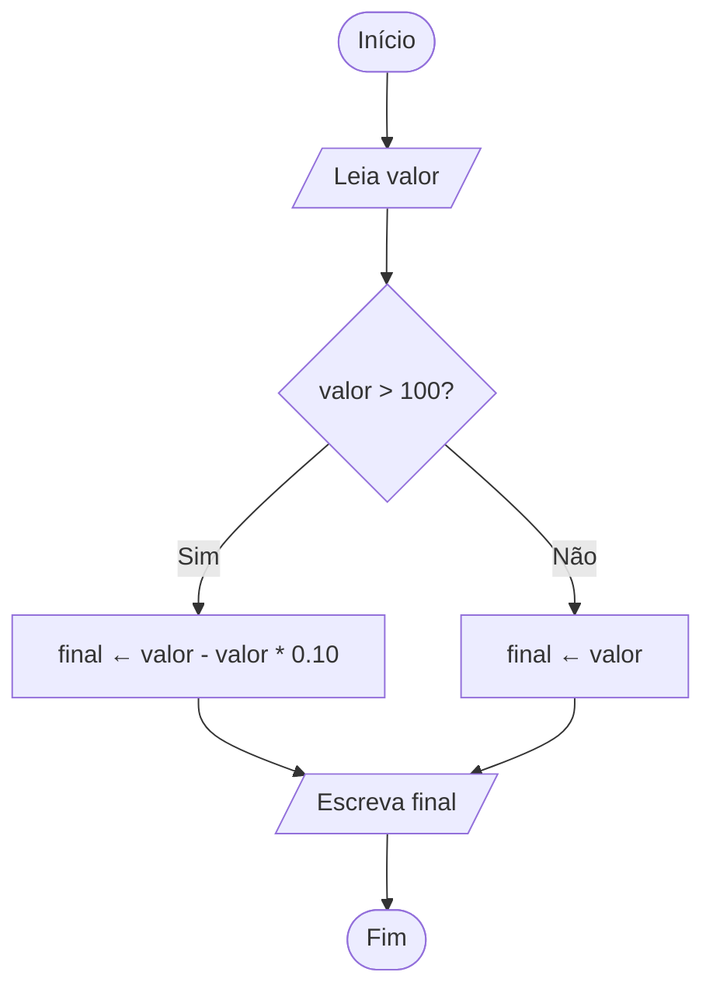

# Exercício 3 — Fluxograma

**Problema:** Uma loja dá desconto de 10% para compras acima de R$ 100. Leia o valor da compra e mostre o valor final a pagar.

## Fluxograma (Mermaid)




## Fluxograma em ASCII (alternativa para papel)

```
        ( Início )
            |
     /-----------------/
    / Leia valor      /
   /-----------------/
            |
      < valor > 100? >
        /         \
      Sim          Não
       |            |
 [final ←      [final ← valor]
  valor - 10%]      |
       \           /
        \         /
     /-----------------/
    / Escreva final   /
   /-----------------/
            |
         ( Fim )
```

O fluxograma tem **início/fim** (ovais), **entrada** (Leia valor), um **losango de decisão** (valor > 100?) com os dois caminhos **Sim** e **Não**, um **processo** de cálculo e a **saída** (Escreva final).