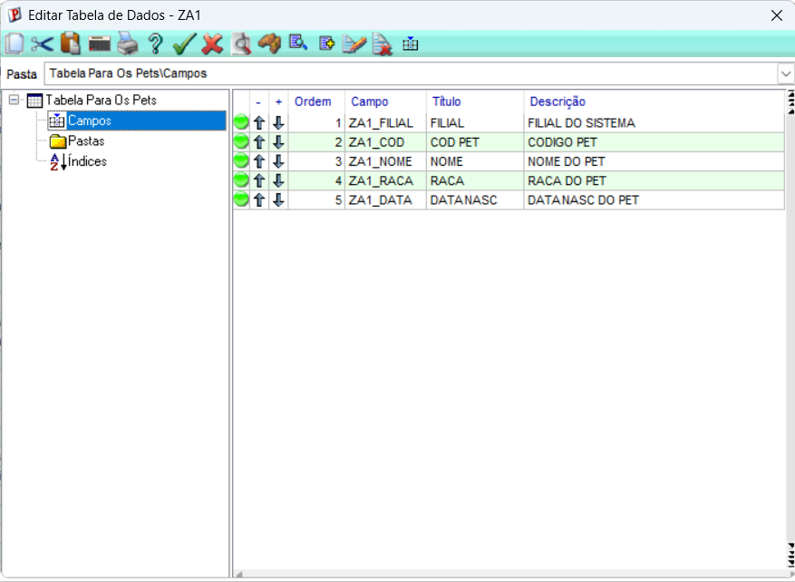
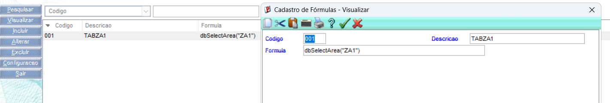
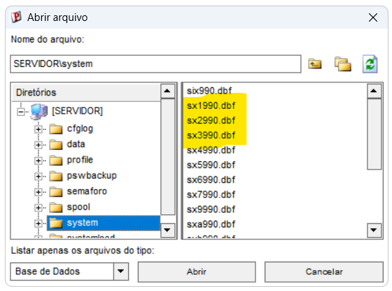
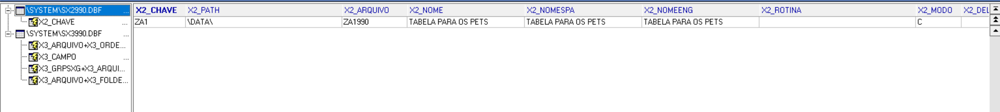
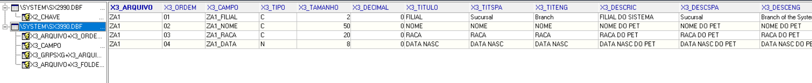

a. Cadastrar no dicionário (SX2/SX3)
Entrar em SIGACFG > Base de Dados > Dicionário > Base de Dados

SX2: criar a tabela ZA1 (nome físico ZA1990, descrição "Cadastro de Pets", modo E).
SX3: criar os campos:
ZA1_FILIAL – C – FILIAL
ZA1_COD - C - COD PET
ZA1_NOME – C – NOME
ZA1_RACA – C – RACA
ZA1_DATA – D – DATANASC

b. Forçar reconhecimento do framework
Rodar a rotina/fórmula que abre o alias ZA1. Ao referenciar a tabela, o framework lê o dicionário e cria o arquivo físico no banco.

c. Conferir no MPSDU
Abrir o MPSDU, localizar a tabela ZA1990 e confirmar que as colunas (ZA1_FILIAL, ZA1_COD, ZA1_NOME, ZA1_RACA, ZA1_DTNASC) existem com os tipos/tamanhos certos.

