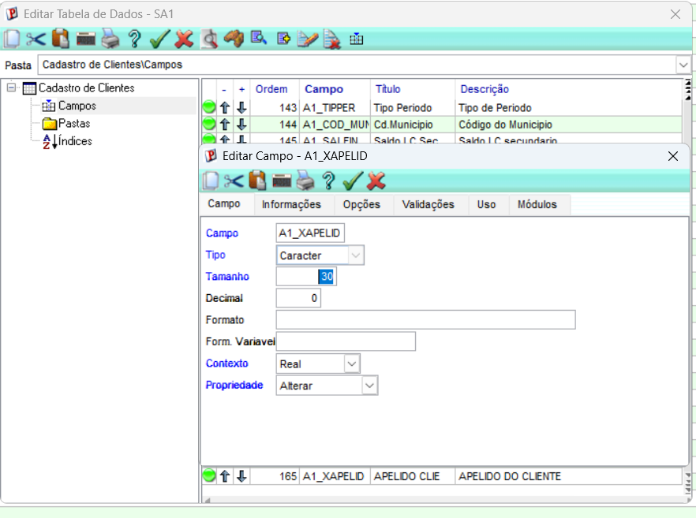
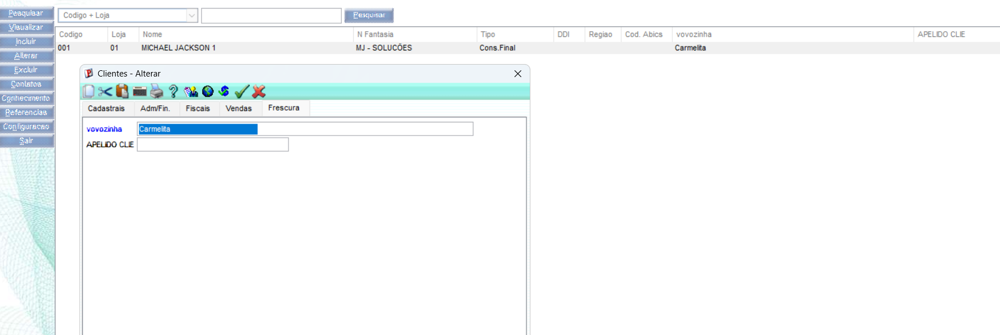

a - Campo customizado na SA1 - Abra o dicionário — SIGACFG > Base de Dados > Dicionário > Base de Dados. Selecione a tabela SA1.

b - Entre no SmartClient e abra o cadastro de Clientes — SIGAFAT (ou SIGACOM) > Atualizações > Cadastros > Clientes.
Posicione um cliente e clique em Alterar (ou Incluir). O campo Apelido já aparece na tela, na aba/pasta correspondente, pronto para digitar — puramente por causa da definição na SX3.

