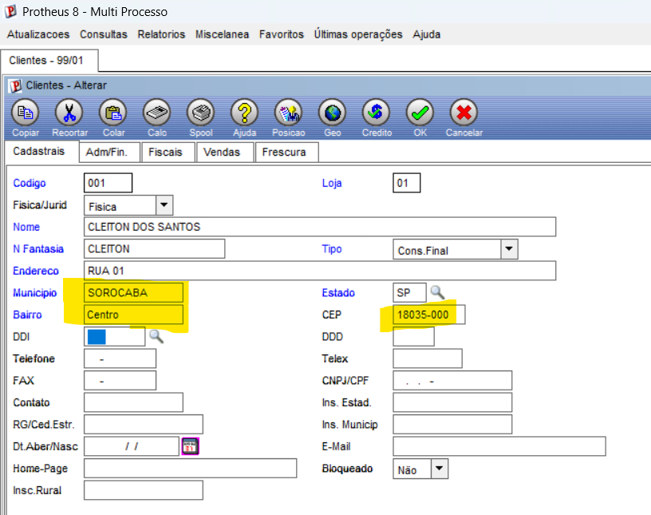
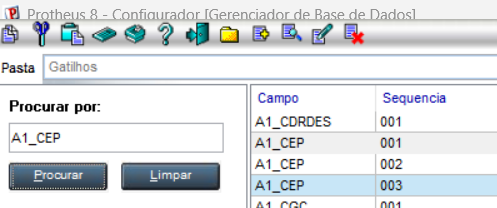
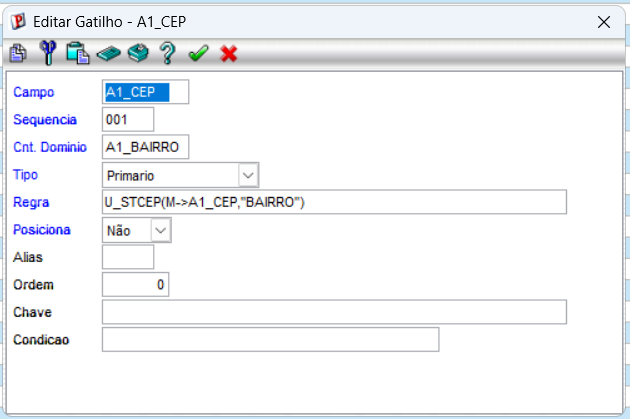
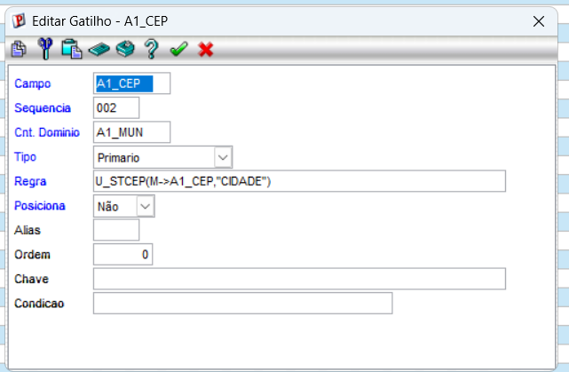
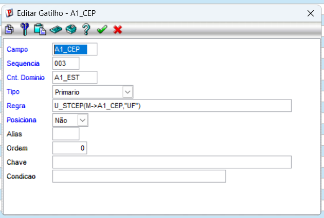

PRINT CADASTRO CLIENTE - INCLUINDO AUTOMATICO.

GATILHOS - A1_CEP

A1_CEP - SEQ-001

A1_CEP - SEQ-002

A1_CEP - SEQ-003

---------------------------------------------------------------------

#include "protheus.ch"

/*/{Protheus.doc} STCEP
Preenchimento automático de endereço a partir do CEP.

Feita para ser chamada por um GATILHO (SX7) do campo A1_CEP no cadastro de
Clientes (SA1). O gatilho pergunta "qual é o bairro/município/UF desse CEP?"
e esta função responde.

Uso na regra do gatilho (SIGACFG → Dicionário → Gatilhos):
    U_STCEP(M->A1_CEP,"BAIRRO")
    U_STCEP(M->A1_CEP,"CIDADE")
    U_STCEP(M->A1_CEP,"UF")

@param cCEP     CEP digitado (aceita com ou sem máscara: 18035000 ou 18035-000)
@param cRetorno O que devolver: "BAIRRO" (padrão), "CIDADE" ou "UF"
@return caractere com o valor encontrado, ou "" se o CEP não estiver na tabela

@author  Jornada DEV START — Módulo 8
@since   28/07/2026
/*/
USER FUNCTION STCEP(cCEP, cRetorno)

    Local aTabela  := aTabCEP()
    Local cLimpo   := ""
    Local cRet     := ""
    Local nPos     := 0

    Default cCEP     := ""
    Default cRetorno := "BAIRRO"

    // 1) Limpa a máscara: "18035-000" vira "18035000"
    cLimpo := StrTran(StrTran(AllTrim(cCEP), "-", ""), ".", "")

    // 2) Procura o CEP na tabela (aScan devolve a posição ou 0)
    nPos := aScan(aTabela, {|aLinha| aLinha[1] == cLimpo })

    // 3) Devolve o pedaço do endereço que o gatilho pediu
    If nPos > 0
        Do Case
            Case Upper(AllTrim(cRetorno)) == "BAIRRO"
                cRet := aTabela[nPos][2]
            Case Upper(AllTrim(cRetorno)) == "CIDADE"
                cRet := aTabela[nPos][3]
            Case Upper(AllTrim(cRetorno)) == "UF"
                cRet := aTabela[nPos][4]
        EndCase
    EndIf

RETURN cRet

/*/{Protheus.doc} STCEPTESTE
Teste rápido SEM precisar do cadastro de clientes.
Execute pelo SmartClient (Miscelânea → Execução → Programa) digitando STCEPTESTE.
Serve para provar que a função responde ANTES de amarrar o gatilho.

Não usa caixa de digitação de propósito: assim funciona em qualquer versão,
sem depender de função de tela. Para testar outro CEP, troque a linha do cCEP
e compile de novo (F9).
/*/
USER FUNCTION STCEPTESTE()

    Local cCEP := "18035-000"   // <-- troque aqui para testar outro CEP

    MsgInfo("CEP informado: " + cCEP                       + CRLF + ;
            "Bairro: "        + U_STCEP(cCEP, "BAIRRO")    + CRLF + ;
            "Cidade: "        + U_STCEP(cCEP, "CIDADE")    + CRLF + ;
            "UF: "            + U_STCEP(cCEP, "UF"), "Consulta de CEP")

RETURN NIL

/*/{Protheus.doc} aTabCEP
Tabela de CEPs usada no exercício.

⚠� ATENÇÃO — dados de EXEMPLO, montados para a aula.
Em um sistema de verdade estes dados viriam de:
  a) uma tabela de CEP dentro do próprio Protheus, consultada com Posicione(); ou
  b) um serviço externo (ex.: ViaCEP) chamado por HTTP.
O que interessa aqui é o MECANISMO do gatilho, não a base de CEP.

Estrutura de cada linha: { CEP, BAIRRO, CIDADE, UF }
/*/
STATIC FUNCTION aTabCEP()
RETURN {                                                          ;
    { "18035000", "Centro",          "Sorocaba",       "SP" },    ;
    { "18040000", "Vila Hortencia",  "Sorocaba",       "SP" },    ;
    { "18045000", "Jardim Paulista", "Sorocaba",       "SP" },    ;
    { "18110000", "Centro",          "Votorantim",     "SP" },    ;
    { "18200000", "Centro",          "Itapetininga",   "SP" },    ;
    { "01310100", "Bela Vista",      "Sao Paulo",      "SP" },    ;
    { "01001000", "Se",              "Sao Paulo",      "SP" },    ;
    { "04547000", "Vila Olimpia",    "Sao Paulo",      "SP" },    ;
    { "08010000", "Itaquera",        "Sao Paulo",      "SP" },    ;
    { "09010000", "Centro",          "Santo Andre",    "SP" },    ;
    { "13010000", "Centro",          "Campinas",       "SP" },    ;
    { "13330000", "Centro",          "Indaiatuba",     "SP" },    ;
    { "14010000", "Centro",          "Ribeirao Preto", "SP" },    ;
    { "06010000", "Centro",          "Osasco",         "SP" },    ;
    { "07010000", "Centro",          "Guarulhos",      "SP" },    ;
    { "11010000", "Centro",          "Santos",         "SP" },    ;
    { "12210000", "Centro",          "Sao Jose Campos","SP" },    ;
    { "37540000", "Centro",          "Santa Rita",     "MG" },    ;
    { "70070000", "Asa Sul",         "Brasilia",       "DF" },    ;
    { "20010000", "Centro",          "Rio de Janeiro", "RJ" }     ;
}